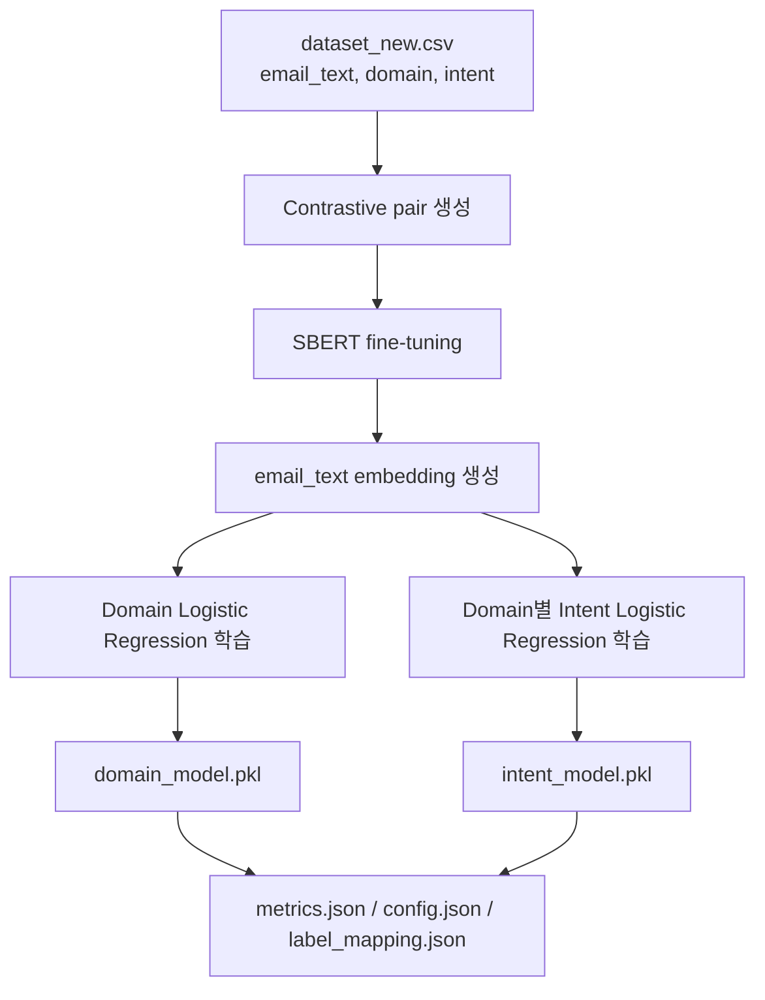
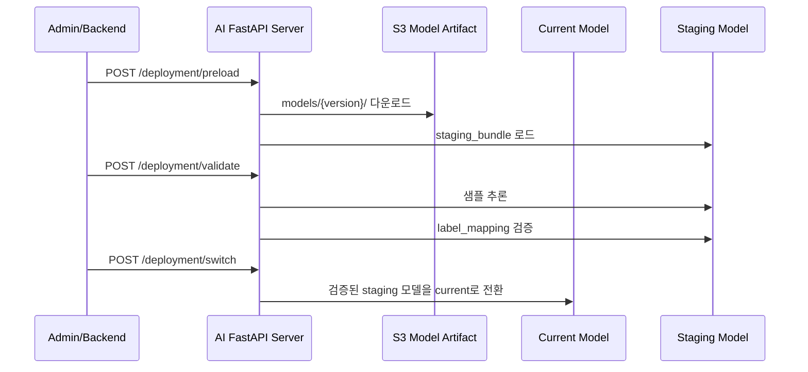

# 업무 이메일 자동화 AI 서버

업무 이메일의 분류, 사용자 맞춤형 답장 초안 생성 및 자동 발송, Google Calendar 연동 기반 일정 등록까지 지원하여 반복적인 업무 처리를 줄이는 **업무용 이메일 자동화 AI Agent 서비스**입니다.

> 실제 운영 중인 업무 이메일 자동화 AI 서비스  
> Production URL: https://capstone.studylink.click/

---

# 문제 정의

업무 이메일은 일정 조율, 비용 처리, 협조 요청, 고객 문의 대응 등 다양한 업무의 시작점이 됩니다.

하지만 실제 업무 환경에서는 메일 내용을 직접 읽고 업무를 분류해야 하고,
일정 여부를 확인하거나 반복적으로 답장을 작성해야 하는 경우가 많습니다.

이 프로젝트는 이러한 반복적인 이메일 처리 부담을 줄이기 위해 시작했습니다.

이메일의 업무 의도를 자동 분류하고,
요약 및 일정 정보를 추출하며,
사용자 맞춤형 답장 초안을 생성할 수 있도록 구성했습니다.

> **분류는 SBERT 기반 ML 모델이 담당하고,  
> LLM은 summary / 일정 추출 같은 후처리에 집중하도록 역할을 분리했습니다.**
>
> 비용, 응답 일관성, latency, 운영 안정성을 함께 고려한 구조입니다.

---

# AI 서버 담당 (전민지)

<strong>AI 서버 상세 구현 내용 보기</strong>

 

- SBERT 기반 계층형 이메일 분류 구조 설계 및 inference pipeline 구현
- FastAPI + RabbitMQ 기반 AI inference / deployment consumer 구현
- SageMaker training container 및 S3 model artifact 관리 구조 구현
- `preload → validate → switch` 기반 무중단 배포 흐름 구현
- Prometheus 기반 운영 모니터링 구성

---

# AI 서버 핵심 기능

- 이메일 제목/본문 기반 `Domain / Intent` 자동 분류
- `SBERT → Domain Logistic Regression → Domain별 Intent Logistic Regression` 계층형 분류
- LLM 기반 이메일 요약 및 일정 정보 추출
- FastAPI 동기 inference API와 RabbitMQ 비동기 consumer 제공
- S3 model artifact와 `latest.json` 기반 모델 버전 관리
- `preload → validate → switch` 기반 모델 교체
- SageMaker training container, Kubernetes dataset batch, Prometheus metrics 구성

기술 스택 보기

| 영역 | 기술 |
|---|---|
| API 서버 | FastAPI, Uvicorn, Pydantic |
| 모델 | SentenceTransformers, SBERT, Scikit-learn LogisticRegression |
| LLM 연동 | 학교 GPU 서버 기반 LLM API (Qwen3.5-35B-A3B) |
| 비동기 처리 | RabbitMQ |
| MLOps | SageMaker Training Job, S3, Kubernetes Job |
| 모니터링 | Prometheus metrics |
| 테스트 | pytest, FastAPI TestClient |
| 실행 환경 | Docker, Python 3.11 |

---

# 왜 이런 AI 구조를 선택했는가

## 1. SBERT + Logistic Regression 기반 분류 구조

- 데이터셋 규모가 크지 않은 환경에서 추론 속도와 운영 안정성을 고려
- SBERT는 문맥 기반 의미 표현을 담당하고, 실제 분류는 가벼운 Logistic Regression으로 수행
- GPU 의존도를 줄이고 CPU 환경에서도 안정적으로 서빙 가능하도록 설계

## 2. Domain → Intent 계층형 분류 구조

- 전체 intent를 한 번에 분류하면 서로 다른 업무 영역 간 오분류 발생
- 먼저 domain으로 업무 영역을 좁힌 뒤 domain별 intent classifier를 수행하도록 구성
- intent 후보군을 줄여 세부 의도 분류 안정성 확보

### 데이터셋 및 분류 범위

| 항목 | 값 |
|---|---:|
| 학습 데이터 샘플 수 | 1,510 |
| Domain 수 | 7 |
| Intent 수 | 30 |

Domain / Intent 분류 범위 보기

### Admin
- 공지 (`Announcement`)
- 내부 보고 (`Internal Report`)
- 자료 요청 (`Document Request`)
- 협조 요청 (`Cooperation Request`)

### CS
- 기술 지원 요청 (`Technical Support`)
- 불만 접수 (`Complaint`)
- 사용법 문의 (`Usage Inquiry`)
- 환불 요청 (`Refund Request`)

### Finance
- 비용 처리 문의 (`Expense Inquiry`)
- 세금계산서 요청 (`Invoice Request`)
- 입금 확인 요청 (`Payment Confirmation`)
- 정산 문의 (`Settlement Inquiry`)

### HR
- 면접 조율 (`Interview Scheduling`)
- 증명서 발급 요청 (`Certificate Request`)
- 채용 문의 (`Recruitment Inquiry`)
- 휴가 신청 (`Leave Request`)

### IT Ops
- 계정 생성 요청 (`Account Creation`)
- 권한 변경 요청 (`Permission Change`)
- 시스템 오류 보고 (`System Error Report`)

### Marketing PR
- 광고 문의 (`Advertising Inquiry`)
- 보도 자료 요청 (`Press Release Request`)
- 인터뷰 요청 (`Interview Request`)
- 콘텐츠 협업 문의 (`Content Collaboration`)
- 행사 캠페인 문의 (`Campaign Inquiry`)
- 협찬 제휴 (`Sponsorship Partnership`)

### Sales
- 가격 협상 (`Price Negotiation`)
- 견적 요청 (`Quotation Request`)
- 계약 문의 (`Contract Inquiry`)
- 미팅 일정 조율 (`Meeting Scheduling`)
- 제안 요청 (`Proposal Request`)

## 3. LLM은 후처리에만 사용

- LLM 단독 분류는 비용, latency, 응답 일관성 문제 존재
- domain / intent 분류는 deterministic한 ML 모델이 담당
- LLM은 summary, 일정 추출 같은 생성 기반 후처리에만 사용

## 4. RabbitMQ 기반 비동기 추론 구조

- LLM 호출 및 일정 파싱은 latency variability 존재
- backend와 AI inference를 느슨하게 분리하기 위해 RabbitMQ 기반 async pipeline 적용
- retry / DLQ 기반 장애 격리 구조 구성

---

# 핵심 아키텍처

## AI 추론 파이프라인

- `SBERT → Domain Classifier → Intent Classifier` 순으로 분류 수행
- 분류 이후 LLM 기반 summary / 일정 추출 수행
- 분류와 생성 역할을 분리해 inference consistency 확보

## 계층형 분류 구조

| 구성 요소 | 사용 기술 | 역할 |
|---|---|---|
| Text Embedding | `sentence-transformers/paraphrase-multilingual-MiniLM-L12-v2` | 이메일 텍스트를 의미 벡터로 변환 |
| SBERT Fine-tuning | `ContrastiveLoss` | 같은 intent는 positive, 같은 domain의 다른 intent는 hard negative로 학습 |
| Domain Classifier | `LogisticRegression` | 상위 업무 영역 분류 |
| Intent Classifier | `dict[str, LogisticRegression]` | Domain별 세부 intent 분류 |
| LLM Processor | 학교 GPU 서버 기반 LLM API | 요약 및 일정 표현 추출 |

## AI 운영 및 MLOps 아키텍처

- Dataset batch → SageMaker training → S3 artifact → AI deployment 흐름 구성
- 재수집 / 재학습 / 재배포 단계를 분리해 운영 안정성 확보
- `latest.json` 기반 active model version 관리

## 무중단 모델 배포 흐름

새 모델은 바로 active model로 교체하지 않습니다.  
먼저 staging 영역에 로드하고, 샘플 추론과 `label_mapping.json` 검증을 통과한 경우에만 current model로 전환합니다.

| 단계 | Endpoint | 동작 |
|---|---|---|
| preload | `POST /deployment/preload` | staging 영역에 새 모델 로드 |
| validate | `POST /deployment/validate` | 샘플 추론 및 label mapping 검증 |
| switch | `POST /deployment/switch` | 검증된 staging 모델을 current model로 전환 |

---

# 기술적 문제 해결 및 운영 경험

# 4-1. 모델 설계 및 학습

## Domain → Intent 계층형 분류 구조 도입

### 문제
전체 intent를 한 번에 분류하자 서로 다른 업무 영역 간 intent confusion이 발생했습니다.

### 해결
`Domain → Intent` 계층형 classifier 구조를 도입했습니다.

### 결과
- 세부 intent 후보군 축소
- cross-domain 오분류 감소
- domain-aware classifier 관리 가능

상세 설계 및 디버깅 과정 보기

### 디버깅
- confusion matrix 기반 intent 혼동 분석
- domain 간 오분류 패턴 확인
- cosine similarity 기반 embedding quality 비교

### 선택지
1. 전체 intent를 하나의 classifier로 직접 분류
2. LLM에게 domain / intent를 모두 분류시키는 구조
3. Domain → Intent 계층형 분류 구조

### 선택한 이유
먼저 domain으로 업무 영역을 좁힌 뒤 intent를 분류하도록 구성해
cross-domain confusion을 줄이고 domain-aware classifier를 운영할 수 있도록 설계했습니다.

## Contrastive Pair 기반 SBERT Fine-tuning

### 문제
기본 multilingual SBERT만으로는 업무 이메일 특화 표현을 충분히 반영하지 못했습니다.

### 해결
Contrastive Pair 기반 SBERT fine-tuning을 적용했습니다.

### 결과
- 같은 intent 이메일은 embedding 공간에서 가깝게 배치
- hard negative intent는 멀어지도록 조정
- Logistic Regression이 더 안정적으로 분리 가능

상세 학습 전략 보기

### 디버깅
- cosine similarity 기반 embedding quality 확인
- confusion matrix 기반 intent 혼동 분석
- 같은 intent / 다른 intent 간 semantic distance 비교

### 선택지
1. SBERT를 frozen embedding으로만 사용
2. classifier 구조를 더 복잡하게 확장
3. contrastive learning 기반 embedding fine-tuning

### 선택한 이유
classifier를 무겁게 키우기보다 embedding space 자체를 업무 intent 기준으로 정렬하는 방향을 선택했습니다.

- Positive: 같은 intent
- Hard Negative: 같은 domain의 다른 intent

### Trade-off
fine-tuning artifact 저장 누락 가능성이 있어,
학습 후 reload 및 필수 파일 검증 로직을 추가했습니다.

### 모델 학습 흐름

## SBERT + Logistic Regression 기반 경량 추론 구조

### 문제
대형 Transformer나 LLM 기반 분류는 latency와 운영 비용 부담이 컸습니다.

### 해결
SBERT embedding + Logistic Regression 기반 경량 분류 구조를 적용했습니다.

### 결과
- CPU 환경에서도 안정적 서빙 가능
- inference latency 감소
- 과적합 위험 감소

구조 선택 이유 보기

### 디버깅
- classifier complexity 증가 시 overfitting 여부 확인
- inference latency 비교
- CPU 환경 inference 시간 측정

### 선택지
1. End-to-End Transformer classifier
2. LLM 직접 분류
3. SBERT + Logistic Regression 하이브리드 구조

### 선택한 이유
문맥 표현은 SBERT가 담당하고,
실제 분류는 가벼운 ML 모델로 처리해 운영 효율성과 추론 안정성을 확보했습니다.

## 데이터 불균형 및 검증 전략

### 문제
특정 domain / intent에 데이터가 편중되어 소수 클래스 성능 왜곡 위험이 존재했습니다.

### 해결
- Macro F1 기반 검증 전략 적용
- domain / intent 분포를 사전 분석

### 결과
- 데이터가 많은 클래스만 잘 맞추는 문제 방지
- validation 신뢰성 향상

상세 검증 전략 보기

### 디버깅
- class distribution 분석
- weighted F1 / macro F1 비교
- Stratified K-Fold 검증

### 선택지
1. accuracy 중심 평가
2. weighted F1 중심 평가
3. macro F1 기반 imbalance 고려 평가

### 선택한 이유
소수 클래스 성능이 묻히지 않도록
macro F1 기반 검증 전략을 함께 사용했습니다.

### Trade-off
macro F1은 전체 accuracy보다 낮게 측정될 수 있지만,
실제 intent별 일반화 성능을 더 잘 반영합니다.

---

# 4-2. AI 서비스 테스트 및 운영 안정화

## 검증 기반 무중단 모델 배포 구조

### 문제
잘못된 모델 artifact가 배포되면 운영 추론 전체가 실패할 수 있었습니다.

### 해결
`preload → validate → switch` 기반 단계적 배포 구조를 구성했습니다.

### 결과
- 검증 실패 시 current model 유지
- runtime 장애 방지
- rollback-safe deployment 가능

상세 배포 구조 보기

### 디버깅
- label_mapping 불일치 상황 검증
- 샘플 추론 실패 상황 테스트
- artifact integrity 검증
- invalid model preload 상황 확인

### 선택지
1. 서버 재시작 기반 모델 교체
2. latest.json 변경 즉시 active model 교체
3. preload → validate → switch 단계적 교체

### 선택한 이유
staging 영역에서 검증 후 switch하도록 구성해,
새 모델 검증 실패가 current model 장애로 이어지지 않도록 설계했습니다.

### Trade-off
current / staging 모델이 동시에 메모리에 올라가기 때문에
일시적으로 메모리 사용량이 증가할 수 있습니다.

### preload → validate → switch sequence

## 비동기 추론 및 장애 격리 구조

### 문제
LLM 호출 및 후처리 과정에서 backend 응답 지연과 장애 전파 위험이 존재했습니다.

### 해결
RabbitMQ 기반 async inference pipeline을 구성했습니다.

### 결과
- retry / DLQ 기반 장애 격리
- malformed payload 분리 처리
- backend와 AI server 느슨한 결합 유지

운영 장애 처리 전략 보기

### 디버깅
- malformed payload 처리 확인
- retry count 추적
- publish 실패 및 consumer crash 로그 분석

### 선택지
1. REST API 기반 동기 처리
2. RabbitMQ 기반 비동기 처리
3. batch polling 방식

### 선택한 이유
RabbitMQ 기반 async pipeline으로 backend와 AI server를 느슨하게 분리하고,
retry / DLQ 기반 장애 격리를 가능하게 했습니다.

## LLM fallback 처리

### 문제
LLM 장애 발생 시 전체 응답 실패 가능성이 존재했습니다.

### 해결
분류와 생성 역할을 분리하고 summary fallback 처리를 적용했습니다.

### 결과
- LLM 실패 시에도 domain / intent 분류 결과 유지
- inference consistency 확보

Fallback 처리 전략 보기

### 디버깅
- LLM timeout 상황 확인
- summary 생성 실패 상황 테스트
- inference pipeline fallback 흐름 검증

### 선택지
1. LLM 실패 시 전체 요청 실패
2. retry만 수행
3. classification 결과 유지 + summary fallback

### 선택한 이유
LLM 실패가 전체 inference failure로 이어지지 않도록
classification 결과를 독립적으로 유지했습니다.

## Monitoring 및 운영 지표 구성

### 문제
모델 교체 이후 latency 증가나 confidence 저하를 추적할 수단이 필요했습니다.

### 해결
Prometheus 기반 metrics를 구성했습니다.

### 결과
- latency / confidence / error 추적 가능
- active model version 기반 배포 전후 비교 가능

수집 지표 보기

| Metric | 설명 |
|---|---|
| `ai_classify_requests_total` | inference request count |
| `ai_classify_latency_seconds` | inference latency |
| `ai_classify_confidence_score` | confidence score 분포 |
| `ai_schedule_detected_total` | 일정 감지 횟수 |
| `ai_classify_errors_total` | error monitoring |
| `ai_active_model_info` | active model version |

---

# 4-3. 데이터 / MLOps

## dataset merge / dedup 전략

### 문제
새 dataset overwrite 시 기존 데이터 유실 및 중복 누적 위험이 존재했습니다.

### 해결
기존 dataset 다운로드 후 merge / dedup을 수행했습니다.

### 결과
- 데이터 유실 방지
- 중복 통제
- email_text 포맷 일관성 유지

상세 데이터 운영 전략 보기

### 디버깅
- duplicate row 검출
- overwrite 시 데이터 유실 확인
- email_text consistency 검증

### 선택지
1. overwrite
2. append
3. merge / dedup

### 선택한 이유
기존 데이터 보존과 중복 방지를 동시에 만족하기 위해
merge / dedup 전략을 선택했습니다.

### Trade-off
기존 dataset 다운로드 과정으로 batch 처리 시간이 증가할 수 있습니다.

## 모델 Artifact 표준화

### 문제
legacy artifact와 SageMaker artifact 구조가 혼재되어 runtime load failure 위험이 존재했습니다.

### 해결
표준 모델 artifact 구조를 정의하고 필수 파일 검증 로직을 적용했습니다.

### 결과
- artifact integrity 확보
- deployment validation 가능
- 모델 로딩 consistency 향상

Artifact 관리 전략 보기

### 디버깅
- artifact load failure 분석
- missing file 상황 검증
- legacy naming 충돌 확인

### 선택지
1. local artifact naming 유지
2. SageMaker artifact 구조 표준화

### 선택한 이유
운영 환경에서 artifact consistency를 유지하기 위해
표준 artifact 구조를 정의했습니다.

## latest.json 기반 모델 버전 관리

### 문제
active model version 관리 및 rollback 기준이 필요했습니다.

### 해결
`latest.json` 기반 active candidate model 관리 구조를 적용했습니다.

### 결과
- 운영 서버의 모델 버전 관리 단순화
- deployment consistency 확보

모델 버전 관리 전략 보기

### 디버깅
- 잘못된 active version 로드 확인
- deployment ordering 문제 분석

### 선택지
1. 수동 버전 지정
2. 최신 폴더 자동 탐색
3. latest.json 기반 active version 관리

### 선택한 이유
운영 서버와 deployment pipeline 간 version consistency를 유지하기 위해
latest.json 기반 구조를 적용했습니다.

---

# 실제 서비스 운영 결과

> 실제 서비스 화면에서 이메일 분류, 요약, 일정 추출,
> 사용자 맞춤형 답장 초안 생성 기능을 확인할 수 있습니다.

---

# 테스트 전략

AI 모델 정확도뿐 아니라,
배포 안정성·메시지 계약·운영 장애 상황까지 테스트 대상으로 포함했습니다.

주요 테스트 시나리오 보기

- deployment validation 실패 시 switch 차단 검증
- malformed payload schema validation
- retry / DLQ 정책 검증
- message contract validation
- schedule extraction edge case 테스트
- artifact 누락 검증
- latest.json 불일치 상황 테스트
- current/staging model isolation 검증

테스트 범위 보기

| 범위 | 테스트 파일 |
|---|---|
| API / schema | `tests/test_classify.py`, `tests/test_deployment_router.py` |
| 메시지 계약 | `tests/test_message_contracts.py`, `tests/test_retry_policy.py` |
| 모델 로딩/교체 | `tests/test_model_loader.py`, `tests/test_model_manager.py` |
| MLOps | `tests/test_training_container_entrypoint.py`, `tests/test_training_events.py`, `tests/test_dataset_batch.py` |
| 모델 학습 보조 | `tests/test_train_sbert_artifact.py`, `tests/test_training_cv_guards.py` |
| 운영 지표/일정 파싱 | `tests/test_metrics_endpoint.py`, `tests/test_schedule_parser.py` |

---

# 회고 / 한계

- 데이터셋 규모가 크지 않아 일부 intent는 샘플 부족 문제 존재
- 계층형 구조 특성상 domain classifier 오류가 intent 단계까지 전파될 수 있음
- current/staging 모델 동시 로드로 메모리 사용량 증가 trade-off 존재
- Prometheus label cardinality 증가 가능성 고려 필요
