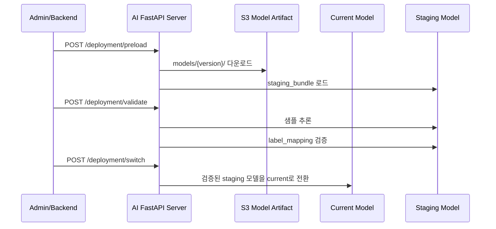
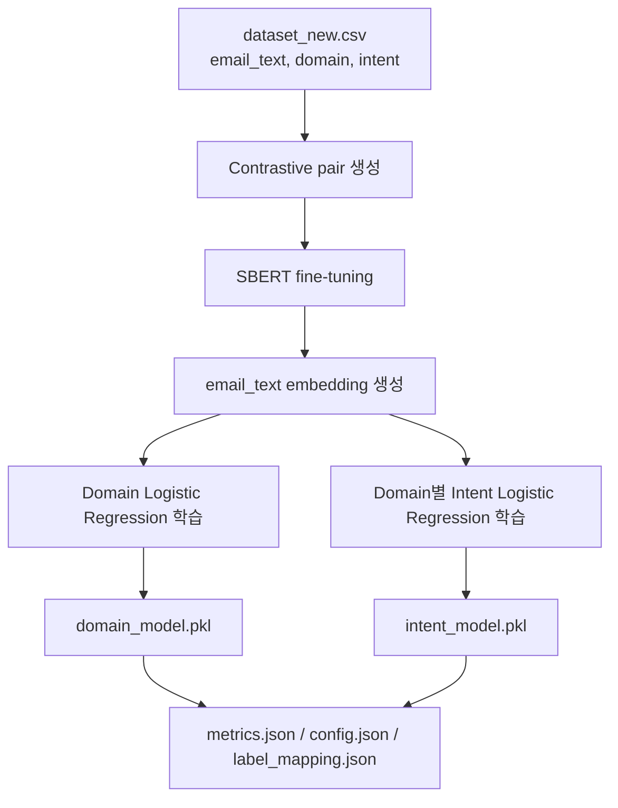

# 업무 이메일 자동화 AI 서버

업무 이메일의 분류, 사용자 맞춤형 답장 초안 생성 및 자동 발송, Google Calendar 연동 기반 일정 등록까지 지원하여 반복적인 업무 처리를 줄이는 **업무용 이메일 자동화 AI Agent 서비스**입니다.

> 업무 이메일의 의도를 안정적으로 분류하기 위해 `SBERT + Logistic Regression` 기반 계층형 분류 구조를 사용했습니다.
> LLM은 전체 판단을 대체하지 않고 이메일 요약과 일정 추출 같은 후처리에 집중하도록 구성해, 서비스 목적에 맞는 일관성과 운영 안정성을 고려했습니다.


## 서비스 링크

- Production URL: https://capstone.studylink.click/

실제 운영 중인 업무 이메일 AI 자동화 서비스입니다.

## AI 서버 핵심 기능

- 이메일 제목/본문 기반 `Domain / Intent` 자동 분류
- `SBERT → Domain Logistic Regression → Domain별 Intent Logistic Regression` 계층형 분류
- LLM 기반 이메일 요약 및 일정 정보 추출
- FastAPI 동기 inference API와 RabbitMQ 비동기 consumer 제공
- S3 model artifact와 `latest.json` 기반 모델 버전 관리
- `preload → validate → switch` 기반 모델 교체
- SageMaker training container, Kubernetes dataset batch, Prometheus metrics 구성

## 기술 스택

| 영역 | 기술 |
|---|---|
| API 서버 | FastAPI, Uvicorn, Pydantic |
| 모델 | SentenceTransformers, SBERT, Scikit-learn LogisticRegression |
| LLM 연동 | 학교 GPU 서버 기반 LLM API (Qwen3.5-35B-A3B) |
| 비동기 처리 | RabbitMQ |
| MLOps | SageMaker Training Job, S3, Kubernetes Job |
| 모니터링 | Prometheus metrics |
| 테스트 | pytest, FastAPI TestClient |
| 실행 환경 | Docker, Python 3.11 |

## 문제 정의

업무 이메일은 분류, 요약, 일정 확인처럼 반복되는 처리가 많습니다. 모든 판단을 LLM에 맡기면 비용, 응답 일관성, latency, 운영 관리 측면에서 부담이 생깁니다.

이 프로젝트는 분류는 전통 ML 모델이 담당하고, LLM은 후처리에 집중하도록 역할을 분리했습니다. 그 위에 모델 재학습, artifact 관리, 모델 교체, 모니터링 흐름을 붙여 실제 AI 서버 형태로 구성했습니다.

## 모델 추론 파이프라인


LLM은 분류기를 대체하지 않습니다. 분류는 `SBERT → Domain Logistic Regression → Domain별 Intent Logistic Regression` 순서로 수행하고, LLM은 요약과 일정 표현 추출에 사용합니다.

## 모델 구조


핵심은 `Domain → Intent` hierarchical classification 구조입니다. 먼저 상위 업무 영역을 좁힌 뒤, 해당 Domain의 Intent classifier로 세부 의도를 예측합니다.

| 구성 요소 | 사용 기술 | 역할 |
|---|---|---|
| Text Embedding | `sentence-transformers/paraphrase-multilingual-MiniLM-L12-v2` | 이메일 텍스트를 의미 벡터로 변환 |
| SBERT Fine-tuning | `ContrastiveLoss` | 같은 intent는 positive, 같은 domain의 다른 intent는 hard negative로 학습 |
| Domain Classifier | `LogisticRegression` | 상위 업무 영역 분류 |
| Intent Classifier | `dict[str, LogisticRegression]` | Domain별 세부 intent 분류 |
| LLM Processor | 학교 GPU 서버 기반 LLM API | 요약 및 일정 표현 추출 |

## 데이터셋 및 분류 범위

| 항목 | 값 |
|---|---:|
| 학습 데이터 샘플 수 | 1,510 |
| Domain 수 | 7 |
| Intent 수 | 30 |

## 운영 배포 구조


새 모델은 바로 active model로 교체하지 않습니다. 먼저 staging 영역에 로드하고, 샘플 추론과 `label_mapping.json` 검증을 통과한 경우에만 current model로 전환합니다.

| 단계 | Endpoint | 동작 |
|---|---|---|
| preload | `POST /deployment/preload` | 요청한 `modelVersion` 또는 `latest.json` 기준 모델을 S3에서 받아 staging에 로드 |
| validate | `POST /deployment/validate` | staging 모델 샘플 추론 및 label mapping 검증 |
| switch | `POST /deployment/switch` | 검증된 staging 모델을 active model로 전환 |

<details>
<summary>preload → validate → switch sequence 보기</summary>



</details>

## AI 운영 및 MLOps 아키텍처


재수집, 재학습, 재배포를 분리해 운영합니다. Dataset batch는 DB에서 학습 데이터를 추출해 S3 dataset을 갱신하고, training container는 SageMaker 환경에서 모델 artifact를 생성한 뒤 S3에 업로드합니다.

## 모델 학습 흐름

학습 입력 dataset은 `email_text`, `domain`, `intent` 컬럼을 필수로 사용합니다. Dataset batch에서는 `subject + body`로 `email_text`를 다시 생성해 학습 입력을 일관되게 맞춥니다.

<details>
<summary>모델 학습 흐름 보기</summary>



</details>

<details>
<summary>운영 endpoint 및 메시지 Payload 보기</summary>

| Method | Endpoint | 역할 |
|---|---|---|
| `GET` | `/health` | 서버 상태 확인 |
| `POST` | `/deployment/preload` | 새 모델 staging 로드 |
| `POST` | `/deployment/validate` | staging 모델 검증 |
| `POST` | `/deployment/switch` | active model 전환 |
| `GET` | `/metrics` | Prometheus metric 노출 |

### RabbitMQ 메시지 Payload 예시

```json
{
  "outbox_id": 1,
  "email_id": 1,
  "sender_email": "sender@example.com",
  "sender_name": "홍길동",
  "subject": "세금계산서 발행 요청",
  "body_clean": "지난달 납품 건에 대한 세금계산서 발행 부탁드립니다.",
  "received_at": "2026-04-06T10:00:00"
}
```

### AI 처리 결과 Payload 예시

```json
{
  "outbox_id": 1,
  "email_id": 1,
  "domain": "Finance",
  "intent": "Invoice Request",
  "confidence_score": 0.91,
  "summary_text": "세금계산서 발행 요청 건입니다.",
  "schedule_detected": true,
  "entities_json": {
    "date": "2026-04-14",
    "time": "14:00",
    "location": "회의실 A"
  },
  "model_version": "2026-04-14-001"
}
```

운영 서비스에서는 backend와 AI server가 RabbitMQ 메시지를 통해 분류 요청과 결과를 주고받습니다. REST endpoint는 모델 배포, health check, monitoring 같은 운영/관리 용도로 사용합니다.

</details>

## 시스템 설계 포인트

| 구현한 내용 | 설명 |
|---|---|
| 분류와 LLM 역할 분리 | 분류는 SBERT + Logistic Regression이 담당하고, LLM은 요약/일정 추출에 사용합니다. |
| 계층형 분류 구조 | Domain을 먼저 예측한 뒤 해당 Domain의 Intent classifier로 세부 의도를 분류합니다. |
| 모델 교체 안정성 | 새 모델을 바로 덮어쓰지 않고 `preload → validate → switch` 단계를 둡니다. |
| 비동기 메시지 처리 | classify/deployment consumer로 API 요청 흐름과 긴 작업을 분리합니다. |
| 학습 산출물 표준화 | SageMaker 학습 결과를 `sbert`, `domain_model.pkl`, `intent_model.pkl`, `label_mapping.json`, `metrics.json`, `config.json` 단위로 관리합니다. |
| 운영 지표 노출 | `/metrics`에서 request count, latency, confidence, error, active model 정보를 Prometheus 형식으로 제공합니다. |

## 주요 설계 결정

| 고민한 지점 | 선택한 방식 | 이유 |
|---|---|---|
| 텍스트 표현 방식 | SBERT 기반 이메일 텍스트 임베딩 | 제목/본문의 의미적 유사성을 반영하기 위해 |
| 분류 모델 | SBERT embedding + Logistic Regression | 데이터셋 규모가 크지 않은 상황에서 학습/추론이 빠르고 baseline으로 안정적이기 때문 |
| 세부 의도 분류 | Domain → Intent 계층형 구조 | 업무 영역을 먼저 좁혀 세부 의도 오분류를 줄이기 위해 |
| LLM 사용 범위 | 분류는 ML 모델, LLM은 요약/일정 추출 | 비용, 일관성, latency를 관리하기 위해 |
| 모델 교체 | `preload → validate → switch` | 검증 실패 시 기존 모델을 유지하기 위해 |
| 긴 작업 처리 | RabbitMQ 메시지 기반 처리 | 학습/배포 작업을 API 요청 흐름과 분리하기 위해 |
| artifact 관리 | S3에 version 단위 저장 | 모델 파일, label mapping, metrics, config를 배포 단위로 관리하기 위해 |

## 트러블슈팅 / 개선 경험

| 항목 | 처리 방식 |
|---|---|
| 모델 artifact 파일명 혼재 | 로컬 legacy artifact와 SageMaker 표준 artifact 로딩 경로 분리 |
| `latest.json` 버전 충돌 | `model_version`, `modelVersion` 값 충돌 시 오류 처리 |
| 불완전한 artifact | SBERT core file, classifier, label mapping, config, metrics 필수 파일 검증 |
| 모델 교체 중 검증 실패 | validate 실패 시 switch가 실행되지 않도록 staging validation flag 사용 |
| LLM 영구 오류 | 분류 결과는 유지하고 summary fallback 적용 |
| dataset overwrite 위험 | 기존 dataset을 S3에서 받아 병합/dedup 후 업로드 |

## 실제 서비스 예시


실제 서비스 화면에서는 이메일별 분류 결과를 확인할 수 있습니다.

- Domain / Intent 예측 결과
- 이메일 요약
- 일정 추출 결과

## 모니터링

`GET /metrics`는 운영 중인 inference 상태를 Prometheus 형식으로 노출합니다. 요청 수, inference latency, error count, active model version을 확인할 수 있어 모델 교체 이후에도 서버 상태를 추적할 수 있습니다.

<나중에 추가할 Grafana 대시보드 이미지>

| Metric | 설명 |
|---|---|
| `ai_classify_requests_total` | inference request count |
| `ai_classify_latency_seconds` | inference latency |
| `ai_classify_confidence_score` | 최종 confidence score 분포 |
| `ai_schedule_detected_total` | 일정 정보 감지 횟수 |
| `ai_classify_errors_total` | error monitoring |
| `ai_active_model_info` | active model version 표시 |

## 테스트 전략

모델 추론뿐 아니라 배포, 메시지 계약, MLOps batch까지 테스트 대상으로 포함했습니다.

| 범위 | 테스트 파일 |
|---|---|
| API / schema | `tests/test_classify.py`, `tests/test_deployment_router.py` |
| 메시지 계약 | `tests/test_message_contracts.py`, `tests/test_retry_policy.py` |
| 모델 로딩/교체 | `tests/test_model_loader.py`, `tests/test_model_manager.py` |
| MLOps | `tests/test_training_container_entrypoint.py`, `tests/test_training_events.py`, `tests/test_dataset_batch.py` |
| 모델 학습 보조 | `tests/test_train_sbert_artifact.py`, `tests/test_training_cv_guards.py` |
| 운영 지표/일정 파싱 | `tests/test_metrics_endpoint.py`, `tests/test_schedule_parser.py` |

## AI 서버 담당 (전민지)

- SBERT 기반 계층형 이메일 분류 구조 설계 및 inference pipeline 구현
- FastAPI + RabbitMQ 기반 AI inference / deployment consumer 구현
- SageMaker training container 및 S3 model artifact 관리 구조 구현
- `preload → validate → switch` 기반 모델 교체 흐름 구현
- Prometheus metrics 및 운영 모니터링 구성
- dataset batch, message contract, deployment 관련 테스트 작성

## 디렉터리 구조

```text
api/          FastAPI router & schema
src/          inference / training / metrics
messaging/    RabbitMQ consumer & publisher
batch/        dataset batch
tests/        API / MLOps / model tests
```
