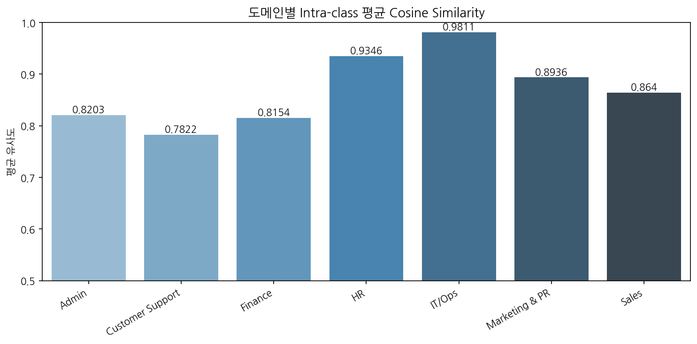
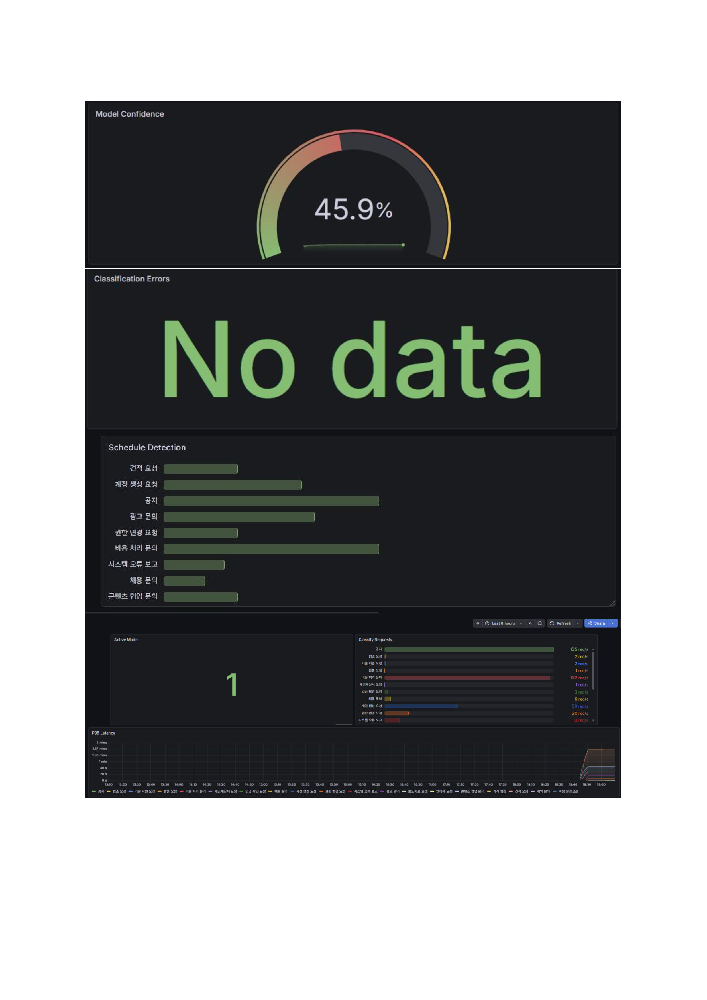
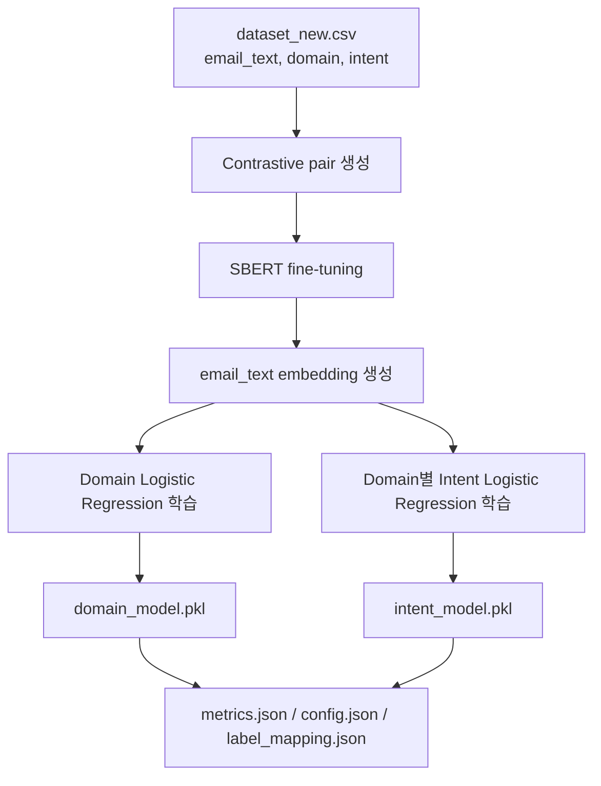
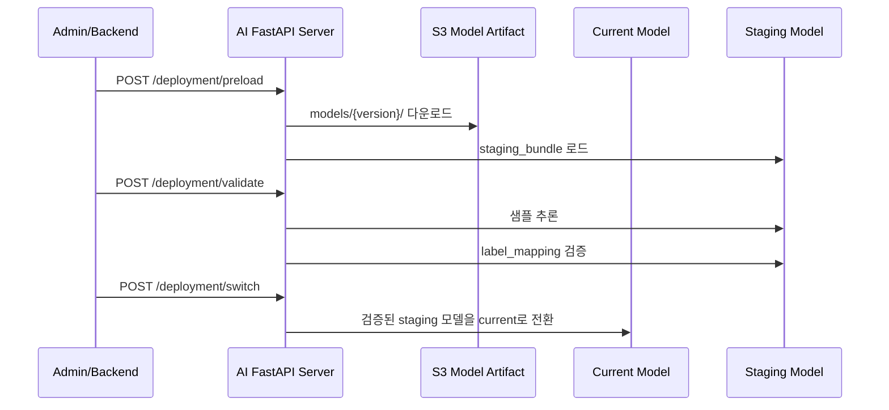

# 업무 이메일 자동화 AI 서버

실제 업무 환경에서는 메일 내용을 직접 읽고 업무를 분류해야 하고,  
일정 여부를 확인하거나 반복적으로 답장을 작성해야 하는 경우가 많습니다.

이 프로젝트는 이러한 반복적인 이메일 처리 부담을 줄이기 위해 시작했습니다.  

이메일의 업무 분야(Domain)와 세부 요청 의도(Intent)를 자동 분류하고,  
이메일 요약 · 일정 정보 추출 · 답장 초안 생성을 지원하는  
**업무용 이메일 자동화 AI Agent 서비스**입니다.
> 특히 실제 사용자 환경에서 AI 응답 품질과 **분류 안정성을 높이기 위한 테스트와 개선 과정에 집중**했습니다.

> **https://capstone.studylink.click/**

> 현재 서비스는 재수집·재학습 기반으로 운영되고 있으며,
모델 성능은 데이터셋과 모델 버전에 따라 **지속적으로 업데이트**됩니다.

---

# 담당 역할 (전민지)

- **AI 응답 품질 분석** - 오분류 패턴 분석 및 계층형 분류 구조 설계
- **사용자 입력 robustness 검증** - 실제 사용자 입력 기반 테스트 및 데이터 개선
- **테스트 시나리오 설계** - 다양한 상황을 가정한 AI 응답 품질 검증
- **AI 품질 모니터링** - Prometheus + Grafana 기반 AI 품질 모니터링 구성
- **inference pipeline 설계** - SBERT 기반 이메일 분류 및 LLM fallback 구조 구현
- **무중단 모델 배포** - SageMaker 기반 모델 학습 및 무중단 배포 구현

기술 스택 보기

FastAPI · SentenceTransformers(SBERT) · Scikit-learn · RabbitMQ · SageMaker · S3 · Kubernetes · Prometheus · Docker · Python 3.11 · LLM API (Qwen3.5-35B-A3B)

---

# AI 품질 분석 및 개선 경험

## Ⅰ. Domain 오분류 패턴 발견과 계층형 분류 설계

추론 테스트를 진행하면서  
**AI가 어떤 패턴에서 오분류를 발생시키는지**를 분석했습니다.

> confusion matrix 분석 결과,  
> Finance 샘플 일부가 Admin으로 잘못 분류되는 현상을 확인했습니다.
>
> 특히 "비용 처리", "정산", "승인 요청"과 같은 표현이  
> 행정 업무 표현과 임베딩 공간에서 가깝게 배치되면서  
> Finance recall이 낮아지는 문제가 있었습니다.
>
> 또한 현재 구조에서는 domain이 틀리면  
> 이후 intent 분류도 함께 오답이 되는 문제가 존재했습니다.

이를 해결하기 위해  
`Domain → Intent` 기반의 계층형 분류 구조를 도입했습니다.

먼저 업무 분야(Domain)를 분류해 범위를 좁힌 뒤,  
해당 domain 내부에서 세부 intent를 분류하도록 개선했습니다.

**Domain 분류기 성능 측정 결과 (Macro F1: 0.74 / Accuracy: 0.75)**

| Domain | F1 |
|---|---|
| Marketing & PR | 0.85 |
| HR | 0.84 |
| Sales | 0.83 |
| Finance | 0.81 |
| Customer Support | 0.64 |
| IT/Ops | 0.62 |
| Admin | 0.59 |

Finance, HR, Marketing & PR, Sales는  
도메인 특화 표현이 뚜렷해 높은 성능을 보였습니다.

반면 Admin, Customer Support, IT/Ops는  
업무 범위가 겹치는 경우가 많아 일부 혼동이 발생했습니다.

> 예: "계정 생성 요청", "비밀번호 초기화", "기술 지원 요청"

이처럼 실제 업무에서는  
**도메인 경계가 모호한 표현**이 존재했으며,  
이러한 **오분류 패턴**을 분석하고 구조를 개선하는 것이  
AI 품질 향상의 핵심이었습니다.

## Ⅱ. 실제 사용자 입력 다양성 분석과 Robustness 개선

### 문제 인식

학습 데이터를 LLM으로 생성했기 때문에  
intent classifier의 F1이 1.00에 가깝게 나타났습니다.

하지만 이는 모델 성능이 완벽하다는 의미보다는,  
데이터가 지나치게 정형화되어  
실제 사용자 입력 패턴을 충분히 반영하지 못하고 있다는 신호에 가까웠습니다.

실제 업무 이메일에는 다음과 같은 **입력 다양성**이 존재합니다.

| 유형 | 예시 |
|---|---|
| 오타 / 비문 | "확인부탁드림니다", "계산셔 발행 언제대요" |
| 구어체 / 급한 말투 | "빨리좀요!!", "저번에도 말씀드렸는데" |
| 감정 표현 | "아 진짜 급한데", "엄무에 차질생겨여" |
| 맥락 생략 | 인사 없이 바로 본론, 주어 생략 |
| **Ambiguous Domain** | "저번 행사 영수증 처리 됐나요?" → Admin(행사운영)? Finance(비용처리)? |
| **Ambiguous Intent** | "비밀번호 까먹었는데" → IT(계정관리)? Admin(총무)? |

### 대응

단순히 데이터를 늘리는 것이 아니라,  
어떤 유형의 입력이 모델을 취약하게 만드는지를 먼저 분석했습니다.

이후 해당 패턴들을 가이드라인으로 정리하고,  
각 케이스를 반영한 노이즈 데이터를 직접 설계해 증강했습니다.

### 결과

- 정형화된 LLM 생성 데이터의 다양성 보완
- **실제 사용자 입력에 대한 robustness 향상**
- ambiguous domain 케이스에서 오분류 감소

## Ⅲ. Embedding 품질 검증 - SBERT Fine-tuning

기본 multilingual SBERT만으로는  
업무 이메일 특화 표현을 충분히 반영하기 어려웠기 때문에,  
**Contrastive Pair** 기반 SBERT fine-tuning을 적용했습니다.

같은 intent는 가깝게,  
헷갈리기 쉬운 intent는 구분되도록 학습해  
업무 이메일 표현력을 개선했습니다.

또한 fine-tuning 이후  
도메인별 **cosine similarity**를 분석한 결과,  
Customer Support처럼 **표현이 겹치는 도메인**에서  
**오분류가 더 많이 발생하는 패턴**도 함께 확인할 수 있었습니다.

또한 데이터 불균형 문제를 고려해  
accuracy뿐 아니라 **macro F1** 기반 평가를 함께 사용했습니다.

---

# AI 서비스 테스트 전략

단순 모델 정확도가 아니라 **실제 서비스 관점에서 AI 응답이 얼마나 안정적인가**를 검증하는 데 초점을 맞췄습니다.

## 테스트 설계 방향

| 관점 | 검증 목표 |
|---|---|
| **사용자 입력 다양성** | noisy input / 구어체 / 오타 환경에서도 분류가 안정적인가 |
| **Ambiguous Intent** | 도메인 경계가 모호한 입력에서 confidence가 어떻게 나타나는가 |
| **Schedule Extraction** | 자연어 일정 표현의 edge case를 올바르게 파싱하는가 |
| **AI 응답 일관성** | 동일한 의미의 다른 표현에서 같은 intent로 분류되는가 |
| **Fallback 안정성** | LLM 실패 시에도 분류 결과가 유지되는가 |
| **배포 안정성** | 잘못된 모델이 배포되어도 서비스가 중단되지 않는가 |

주요 테스트 시나리오 보기

| 테스트 항목 | 검증 내용 |
|---|---|
| Noisy Input Classification | 오타·구어체·감정 표현 포함 이메일에서 intent 분류 안정성 검증 |
| Ambiguous Domain | Admin/Finance, IT/CS 경계 케이스에서 confidence 분포 확인 |
| Schedule Extraction Edge Case | "다음 주 중으로", "이번 달 안에" 등 모호한 일정 표현 파싱 검증 |
| LLM Fallback | LLM 장애 시 domain / intent 분류 결과 독립 유지 검증 |
| Deployment Validation | validation 실패 시 switch 차단 및 current model 유지 검증 |
| Payload Validation | malformed payload schema validation |
| Retry / DLQ | retry 정책 및 DLQ 처리 검증 |
| Message Contract | producer-consumer message contract 검증 |
| Artifact Validation | artifact 누락 및 integrity 검증 |
| Model Versioning | latest.json 불일치 상황 테스트 |
| Model Isolation | current / staging model isolation 검증 |

---

# AI 품질 모니터링

모델 교체 이후 발생할 수 있는  
latency 증가나 confidence 저하를 추적하기 위해  
Prometheus + Grafana 기반 모니터링을 구성했습니다.

특히 confidence score 분포를 함께 추적해,  
**모델이 애매하게 분류하는 케이스가 증가**하는지도 확인할 수 있도록 했습니다.

수집 지표 보기

| Metric | 설명 |
|---|---|
| `ai_classify_requests_total` | inference request count |
| `ai_classify_latency_seconds` | inference latency |
| `ai_classify_confidence_score` | confidence score 분포 |
| `ai_schedule_detected_total` | 일정 감지 횟수 |
| `ai_classify_errors_total` | error monitoring |
| `ai_active_model_info` | active model version |

Grafana 모니터링 대시보드 보기

> Model Confidence가 45.9%로 나타난 것은  
> 실제 계정 기반 테스트 과정에서  
> 학습 데이터 분포에 포함되지 않은 스팸·광고성 메일이 함께 유입되었기 때문입니다.
>
> 현재 분류 모델은 업무 이메일 intent 분류를 목표로 학습되었으며,  
> 스팸·프로모션 메일에 대한 별도 filtering 또는 OOD(out-of-distribution) 처리는 포함하지 않았습니다.
>
> 따라서 향후에는 spam filtering 및 unknown intent 대응을 추가해  
> 실제 운영 환경에서의 robustness를 보완할 필요가 있습니다.

---

# AI 구조 설계 결정

## 1. SBERT + Logistic Regression 기반 경량 분류

- 데이터셋 규모가 크지 않은 환경에서 **추론 속도와 운영 안정성**을 고려
- SBERT는 **문맥 기반 의미 표현**을 담당하고, 실제 분류는 **가벼운 Logistic Regression**으로 수행
- **GPU 의존도를 줄이고 CPU 환경에서도 안정적으로 서빙** 가능하도록 설계

## 2. LLM은 후처리에만 사용

- LLM 단독 분류는 **비용, latency, 응답 일관성** 문제 존재
- domain / intent 분류는 **deterministic한 ML 모델**이 담당
- LLM은 **summary, 일정 추출 같은 생성 기반 후처리에만** 사용

## 3. LLM Fallback 처리

LLM 장애 발생 시 전체 응답이 실패하지 않도록, 분류와 생성 역할을 분리하고 summary fallback 처리를 적용했습니다.

**LLM 실패가 전체 inference failure로 이어지지 않도록** classification 결과를 독립적으로 유지했습니다.

- LLM 실패 시에도 domain / intent 분류 결과 유지
- **inference consistency** 확보

## 4. RabbitMQ 기반 비동기 추론 구조

- LLM 호출 및 일정 파싱은 **latency variability** 존재
- backend와 AI inference를 **느슨하게 분리**하기 위해 RabbitMQ 기반 async pipeline 적용
- **retry / DLQ 기반 장애 격리** 구조 구성

---

# 핵심 아키텍처

## AI 추론 파이프라인

- `SBERT → Domain Classifier → Intent Classifier` 순으로 분류 수행
- 분류 이후 LLM 기반 summary / 일정 추출 수행
- 분류와 생성 역할을 분리해 inference consistency 확보

## 계층형 분류 구조

계층형 분류 모델 구성 보기

| 구성 요소 | 사용 기술 | 역할 |
|---|---|---|
| Text Embedding | `sentence-transformers/paraphrase-multilingual-MiniLM-L12-v2` | 이메일 텍스트를 의미 벡터로 변환 |
| SBERT Fine-tuning | `ContrastiveLoss` | 같은 intent는 positive, 같은 domain의 다른 intent는 hard negative로 학습 |
| Domain Classifier | `LogisticRegression` | 상위 업무 영역 분류 |
| Intent Classifier | `dict[str, LogisticRegression]` | Domain별 세부 intent 분류 |
| LLM Processor | 학교 GPU 서버 기반 LLM API | 요약 및 일정 표현 추출 |

## 모델 학습 흐름

MLOps / 배포 아키텍처 보기

## AI 운영 및 MLOps 아키텍처

- Dataset batch → SageMaker training → S3 artifact → AI deployment 흐름 구성
- 재수집 / 재학습 / 재배포 단계를 분리해 운영 안정성 확보
- `latest.json` 기반 active model version 관리

## 무중단 모델 배포 흐름

새 모델은 바로 active model로 교체하지 않습니다.
먼저 staging 영역에 로드하고, 샘플 추론과 `label_mapping.json` 검증을 통과한 경우에만 current model로 전환합니다.

| 단계 | Endpoint | 동작 |
|---|---|---|
| preload | `POST /deployment/preload` | staging 영역에 새 모델 로드 |
| validate | `POST /deployment/validate` | 샘플 추론 및 label mapping 검증 |
| switch | `POST /deployment/switch` | 검증된 staging 모델을 current model로 전환 |

**Trade-off :** current / staging 모델이 동시에 메모리에 올라가기 때문에 **일시적으로 메모리 사용량이 증가**할 수 있습니다.

## Artifact 표준화 및 버전 관리

legacy artifact와 SageMaker artifact 구조가 혼재되어 **runtime load failure** 위험이 있었습니다. **표준 모델 artifact 구조를 정의**하고 필수 파일 검증 로직을 적용해 **artifact integrity**를 확보했습니다.

`latest.json` 기반으로 active candidate model을 관리해 **운영 서버와 deployment pipeline 간 version consistency**를 유지했습니다.

---

# 실제 서비스 운영 결과

> 실제 서비스 화면에서 이메일 분류, 요약, 일정 추출,
> 사용자 맞춤형 답장 초안 생성 기능을 확인할 수 있습니다.

---

# 데이터셋

| 항목 | 값 |
|---|---:|
| 학습 데이터 샘플 수 | 1,510 |
| Domain 수 | 7 |
| Intent 수 | 30 |

> 실제 업무용 이메일 데이터셋을 구하기 어려워, **LLM을 활용해 카테고리별 프롬프트 기반으로 학습 데이터를 직접 생성**했습니다.

---

# 회고 / 한계

- **domain classifier 병목** :  
  Admin / CS / IT/Ops 간 경계가 모호한 케이스에서  
  오분류가 발생하며,  
  domain classifier 오류가 intent 단계까지 전파되는  
  구조적 한계가 있습니다.

- **데이터 다양성 한계** :  
  데이터셋 규모가 크지 않아  
  일부 intent는 샘플 부족 문제가 있었습니다.
  
  노이즈 증강으로 보완했으나,  
  실제 사용자 입력의 다양성을  
  완전히 커버하기는 어려웠습니다.
- **OOD 입력 대응** : 스팸·광고성 메일처럼 학습 범위 밖의 입력(Out-of-Distribution)에 대한 명시적 필터링이나 fallback 전략이 부재해, 실서비스 테스트 시 confidence가 낮아지는 상황이 발생했습니다
