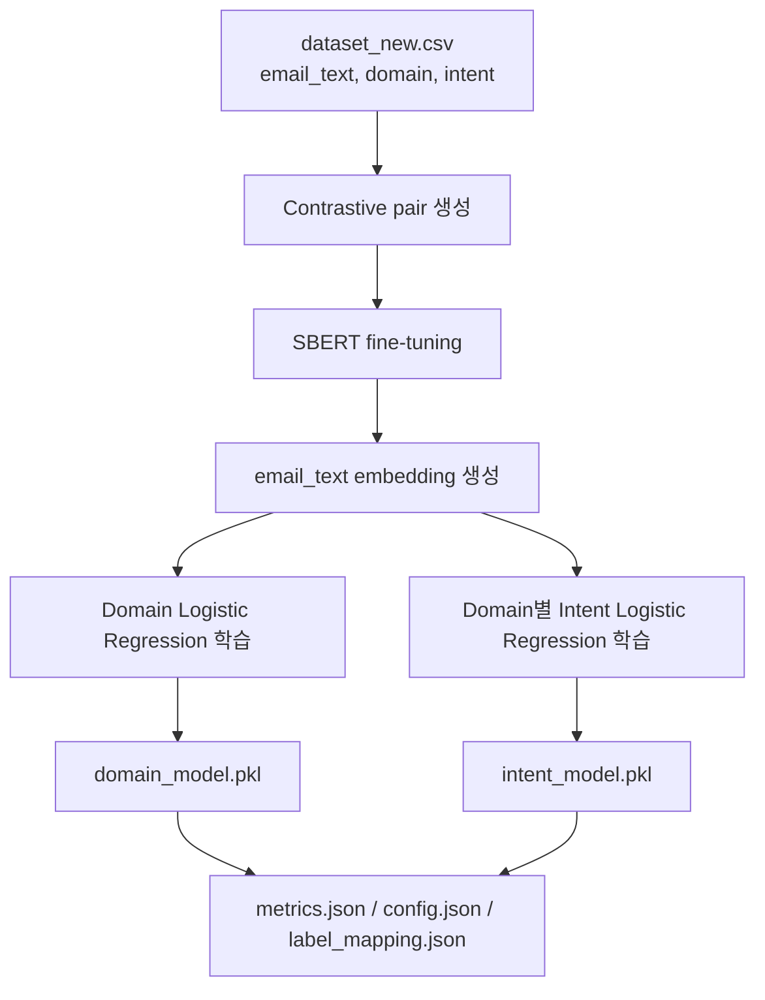
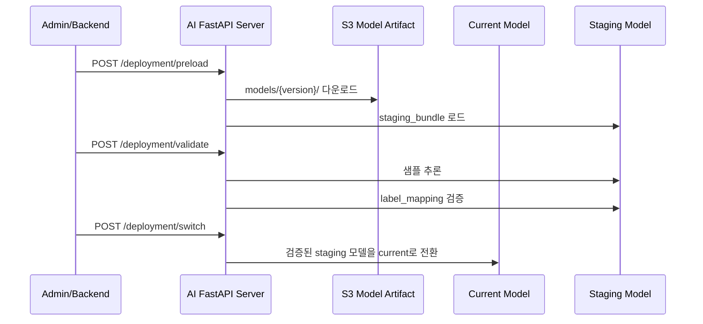

# 업무 이메일 자동화 AI 서버

업무 이메일의 분류, 사용자 맞춤형 답장 초안 생성 및 자동 발송, Google Calendar 연동 기반 일정 등록까지 지원하여 반복적인 업무 처리를 줄이는 **업무용 이메일 자동화 AI Agent 서비스**입니다.

> https://capstone.studylink.click/

---

# 문제 정의

업무 이메일은 일정 조율, 비용 처리, 협조 요청, 고객 문의 대응 등 다양한 업무의 시작점이 됩니다.

하지만 실제 업무 환경에서는 메일 내용을 직접 읽고 업무를 분류해야 하고,
일정 여부를 확인하거나 반복적으로 답장을 작성해야 하는 경우가 많습니다.

이 프로젝트는 이러한 반복적인 이메일 처리 부담을 줄이기 위해 시작했으며,
이메일의 업무 의도를 자동 분류하고 요약 및 일정 정보를 추출해
사용자 맞춤형 답장 초안을 생성할 수 있도록 구성했습니다.

> **분류는 SBERT 기반 ML 모델이 담당하고,  
> LLM은 summary / 일정 추출 같은 후처리에 집중하도록 역할을 분리했습니다.**
>
> 비용, 응답 일관성, latency, 운영 안정성을 함께 고려한 구조입니다.

---

# AI 서버 담당 (전민지)

- SBERT 기반 계층형 이메일 분류 및 inference pipeline 설계
- FastAPI + RabbitMQ 기반 AI inference / deployment consumer 구현
- SageMaker training pipeline 및 S3 model artifact 관리 구조 구현
- `preload → validate → switch` 기반 무중단 모델 배포 구조 구현
- Prometheus 기반 운영 모니터링 및 테스트 구성

기술 스택 보기

FastAPI · SentenceTransformers(SBERT) · Scikit-learn · RabbitMQ · SageMaker · S3 · Kubernetes · Prometheus · Docker · Python 3.11 · LLM API (Qwen3.5-35B-A3B)

---

# AI 서버 핵심 기능

- 이메일 제목/본문 기반 `Domain / Intent` 자동 분류
- `SBERT → Domain Logistic Regression → Domain별 Intent Logistic Regression` 계층형 분류
- LLM 기반 이메일 요약 및 일정 정보 추출
- FastAPI 동기 inference API와 RabbitMQ 비동기 consumer 제공
- S3 model artifact와 `latest.json` 기반 모델 버전 관리
- `preload → validate → switch` 기반 모델 교체
- SageMaker training container, Kubernetes dataset batch, Prometheus metrics 구성

---

# 왜 이런 AI 구조를 선택했는가

## 1. SBERT + Logistic Regression 기반 분류 구조

- 데이터셋 규모가 크지 않은 환경에서 추론 속도와 운영 안정성을 고려
- SBERT는 문맥 기반 의미 표현을 담당하고, 실제 분류는 가벼운 Logistic Regression으로 수행
- GPU 의존도를 줄이고 CPU 환경에서도 안정적으로 서빙 가능하도록 설계

## 2. Domain → Intent 계층형 분류 구조

> confusion matrix를 분석하다가 Finance 샘플 160개 중 21개가 Admin으로 분류되는 것을 발견했습니다. "비용 처리" 관련 표현이 "행정 업무"와 임베딩 공간에서 가깝게 배치되어 있었고, domain classifier의 Finance recall이 0.72로 병목이 되고 있었습니다. domain이 틀리면 intent classifier 성능과 무관하게 오답을 낼 수밖에 없는 구조라, domain 분류를 먼저 안정화하는 방향이 핵심이라고 판단했습니다.

이에 따라 `Domain → Intent` 계층형 classifier 구조를 도입했습니다.

- intent 후보군을 domain 단위로 좁혀 cross-domain 오분류 감소
- domain-aware classifier로 각 domain별 intent 분리 관리 가능

**Domain 분류기 최종 성능 (Macro F1: 0.74 / Accuracy: 0.75)**

| Domain | F1 |
|---|---|
| Marketing & PR | 0.85 |
| HR | 0.84 |
| Sales | 0.83 |
| Finance | 0.81 |
| Customer Support | 0.64 |
| IT/Ops | 0.62 |
| Admin | 0.59 |

> **Finance, HR, Marketing & PR, Sales**는 도메인 특화 표현이 뚜렷해 **0.80 이상의 F1**을 기록했습니다. 반면 **Admin, Customer Support, IT/Ops**는 업무 범위가 유사해 일부 혼동이 발생했습니다. (예: "계정 생성 요청"은 Admin과 IT/Ops 양쪽에 해당 가능, "기술 지원 요청"은 CS와 IT/Ops가 겹침)

### 데이터셋 및 분류 범위

| 항목 | 값 |
|---|---:|
| 학습 데이터 샘플 수 | 1,510 |
| Domain 수 | 7 |
| Intent 수 | 30 |

## 3. LLM은 후처리에만 사용

- LLM 단독 분류는 비용, latency, 응답 일관성 문제 존재
- domain / intent 분류는 deterministic한 ML 모델이 담당
- LLM은 summary, 일정 추출 같은 생성 기반 후처리에만 사용

## 4. RabbitMQ 기반 비동기 추론 구조

- LLM 호출 및 일정 파싱은 latency variability 존재
- backend와 AI inference를 느슨하게 분리하기 위해 RabbitMQ 기반 async pipeline 적용
- retry / DLQ 기반 장애 격리 구조 구성

## 모델 학습 흐름

---

# 핵심 아키텍처

## AI 추론 파이프라인

- `SBERT → Domain Classifier → Intent Classifier` 순으로 분류 수행
- 분류 이후 LLM 기반 summary / 일정 추출 수행
- 분류와 생성 역할을 분리해 inference consistency 확보

## 계층형 분류 구조

계층형 분류 모델 구성 보기

| 구성 요소 | 사용 기술 | 역할 |
|---|---|---|
| Text Embedding | `sentence-transformers/paraphrase-multilingual-MiniLM-L12-v2` | 이메일 텍스트를 의미 벡터로 변환 |
| SBERT Fine-tuning | `ContrastiveLoss` | 같은 intent는 positive, 같은 domain의 다른 intent는 hard negative로 학습 |
| Domain Classifier | `LogisticRegression` | 상위 업무 영역 분류 |
| Intent Classifier | `dict[str, LogisticRegression]` | Domain별 세부 intent 분류 |
| LLM Processor | 학교 GPU 서버 기반 LLM API | 요약 및 일정 표현 추출 |

## AI 운영 및 MLOps 아키텍처

- Dataset batch → SageMaker training → S3 artifact → AI deployment 흐름 구성
- 재수집 / 재학습 / 재배포 단계를 분리해 운영 안정성 확보
- `latest.json` 기반 active model version 관리

## 무중단 모델 배포 흐름

새 모델은 바로 active model로 교체하지 않습니다.  
먼저 staging 영역에 로드하고, 샘플 추론과 `label_mapping.json` 검증을 통과한 경우에만 current model로 전환합니다.

| 단계 | Endpoint | 동작 |
|---|---|---|
| preload | `POST /deployment/preload` | staging 영역에 새 모델 로드 |
| validate | `POST /deployment/validate` | 샘플 추론 및 label mapping 검증 |
| switch | `POST /deployment/switch` | 검증된 staging 모델을 current model로 전환 |

---

# 기술적 문제 해결 및 운영 경험

# 4-1. 모델 설계 및 학습

## Ⅰ. Domain → Intent 계층형 분류 구조 도입

### 문제

> confusion matrix를 분석하다가 **Finance 샘플 160개 중 21개가 Admin으로 분류**되는 것을 발견했습니다. "비용 처리" 관련 표현이 "행정 업무"와 임베딩 공간에서 가깝게 배치되어 **Finance recall이 0.72**로 나타났고, domain이 틀리면 intent classifier 성능과 무관하게 오답이 나오는 구조라 **domain 분류 안정화가 핵심**이라고 판단했습니다. 전체 domain classifier **Macro F1은 0.74**로, Admin(0.59) / CS(0.64) / IT/Ops(0.62) 세 도메인이 업무 범위 유사성으로 인해 낮게 나타났습니다.

### 해결

`Domain → Intent` 계층형 classifier 구조를 도입했습니다.

먼저 **domain으로 업무 영역을 좁힌 뒤 intent를 분류**하도록 구성해
cross-domain confusion을 줄이고 domain-aware classifier를 운영할 수 있도록 설계했습니다.

### 결과

- 세부 intent 후보군 축소
- cross-domain 오분류 감소
- domain-aware classifier 관리 가능

## Ⅱ. Contrastive Pair 기반 SBERT Fine-tuning

### 문제

기본 multilingual SBERT만으로는 업무 이메일 특화 표현을 충분히 반영하지 못했습니다.

### 해결

**Contrastive Pair 기반 SBERT fine-tuning**을 적용했습니다.

- **Positive**: 같은 intent
- **Hard Negative**: 같은 domain의 다른 intent

classifier를 무겁게 키우기보다 **embedding space 자체를 업무 intent 기준으로 정렬**하는 방향을 선택했습니다.

### 결과

fine-tuning 후 도메인별 intra-class cosine similarity를 측정했습니다. **IT/Ops(0.98), HR(0.93)**처럼 intent 간 표현 다양성이 낮은 도메인은 클러스터링이 잘 됐고, **Customer Support(0.78)**는 불만/문의/기술지원이 표현상 겹쳐 상대적으로 낮게 나왔습니다.

**Trade-off:** fine-tuning artifact 저장 누락 가능성이 있어, 학습 후 reload 및 필수 파일 검증 로직을 추가했습니다.

## Ⅲ. 데이터 불균형 및 검증 전략

### 문제

특정 domain / intent에 데이터가 편중되어 소수 클래스 성능 왜곡 위험이 존재했습니다.

### 해결

소수 클래스 성능이 묻히지 않도록 **macro F1 기반 검증 전략**을 적용하고, domain / intent 분포를 사전 분석했습니다.

**Trade-off:** macro F1은 전체 accuracy보다 낮게 측정될 수 있지만, **실제 intent별 일반화 성능**을 더 잘 반영합니다.

### 결과

- 데이터가 많은 클래스만 잘 맞추는 문제 방지
- validation 신뢰성 향상

## Ⅳ. 데이터 한계 인식 및 노이즈 증강

### 문제

학습 데이터를 LLM으로 생성했기 때문에 **intent classifier F1이 1.00에 가깝게** 나왔습니다. 이는 SBERT가 도메인 내 intent를 완벽하게 선형 분리하고 있다는 뜻이기도 하지만, 동시에 **데이터가 지나치게 정형화되어 실제 사용자 입력에 취약**할 수 있다는 신호이기도 했습니다.

### 해결

실제 현업 이메일에서 나타나는 구어체, 오타, 도메인 모호 케이스를 직접 **가이드라인으로 정의하고 노이즈 데이터를 추가 증강**했습니다.

- 구어체 및 문법 파괴 ("확인부탁드림니다", "빨리좀요")
- Admin/Finance처럼 경계가 모호한 중의적 표현
- 맥락 생략 및 감정이 섞인 표현 ("저번에도 말씀드렸는데", "아 진짜 급한데")

### 결과

- 정형화된 LLM 생성 데이터의 다양성 보완
- 실제 사용자 입력에 대한 robustness 향상

---

# 4-2. AI 서비스 테스트 및 운영 안정화

## Ⅰ. 검증 기반 무중단 모델 배포 구조

### 문제

잘못된 모델 artifact가 배포되면 운영 추론 전체가 실패할 수 있었습니다.

### 해결

`preload → validate → switch` 기반 단계적 배포 구조를 구성했습니다.

staging 영역에서 검증 후 switch하도록 구성해, **새 모델 검증 실패가 current model 장애로 이어지지 않도록** 설계했습니다.

### 결과

- **검증 실패 시 current model 유지**
- runtime 장애 방지
- rollback-safe deployment 가능

**Trade-off:** current / staging 모델이 동시에 메모리에 올라가기 때문에 **일시적으로 메모리 사용량이 증가**할 수 있습니다.

## Ⅱ. LLM fallback 처리

### 문제

LLM 장애 발생 시 전체 응답 실패 가능성이 존재했습니다.

### 해결

분류와 생성 역할을 분리하고 summary fallback 처리를 적용했습니다.

**LLM 실패가 전체 inference failure로 이어지지 않도록** classification 결과를 독립적으로 유지했습니다.

### 결과

- LLM 실패 시에도 domain / intent 분류 결과 유지
- inference consistency 확보

## Ⅲ. Monitoring 및 운영 지표 구성

### 문제

모델 교체 이후 latency 증가나 confidence 저하를 추적할 수단이 필요했습니다.

### 해결

Prometheus 기반 metrics를 구성했습니다.

수집 지표 보기

| Metric | 설명 |
|---|---|
| `ai_classify_requests_total` | inference request count |
| `ai_classify_latency_seconds` | inference latency |
| `ai_classify_confidence_score` | confidence score 분포 |
| `ai_schedule_detected_total` | 일정 감지 횟수 |
| `ai_classify_errors_total` | error monitoring |
| `ai_active_model_info` | active model version |

### 결과

- latency / confidence / error 추적 가능
- active model version 기반 배포 전후 비교 가능

---

# 4-3. 데이터 / MLOps

## Ⅰ. 모델 Artifact 표준화

### 문제

legacy artifact와 SageMaker artifact 구조가 혼재되어 runtime load failure 위험이 존재했습니다.

### 해결

표준 모델 artifact 구조를 정의하고 필수 파일 검증 로직을 적용했습니다.

운영 환경에서 artifact consistency를 유지하기 위해 표준 artifact 구조를 정의했습니다.

### 결과

- artifact integrity 확보
- deployment validation 가능
- 모델 로딩 consistency 향상

## Ⅱ. latest.json 기반 모델 버전 관리

### 문제

active model version 관리 및 rollback 기준이 필요했습니다.

### 해결

`latest.json` 기반 active candidate model 관리 구조를 적용했습니다.

운영 서버와 deployment pipeline 간 version consistency를 유지하기 위해 latest.json 기반 구조를 적용했습니다.

### 결과

- 운영 서버의 모델 버전 관리 단순화
- deployment consistency 확보

---

# 실제 서비스 운영 결과

> 실제 서비스 화면에서 이메일 분류, 요약, 일정 추출,
> 사용자 맞춤형 답장 초안 생성 기능을 확인할 수 있습니다.

---

# 테스트 전략

AI 모델 정확도뿐 아니라,
배포 안정성·메시지 계약·운영 장애 상황까지 테스트 대상으로 포함했습니다.

주요 테스트 시나리오 보기

| 테스트 항목 | 검증 내용 |
|---|---|
| Deployment Validation | validation 실패 시 switch 차단 검증 |
| Payload Validation | malformed payload schema validation |
| Retry / DLQ | retry 정책 및 DLQ 처리 검증 |
| Message Contract | producer-consumer message contract 검증 |
| Schedule Extraction | 일정 추출 edge case 테스트 |
| Artifact Validation | artifact 누락 및 integrity 검증 |
| Model Versioning | latest.json 불일치 상황 테스트 |
| Model Isolation | current / staging model isolation 검증 |

---

# 회고 / 한계

- 데이터셋 규모가 크지 않아 일부 intent는 샘플 부족 문제 존재
- 계층형 구조 특성상 domain classifier 오류가 intent 단계까지 전파될 수 있음
- current/staging 모델 동시 로드로 메모리 사용량 증가 trade-off 존재
- Prometheus label cardinality 증가 가능성 고려 필요
